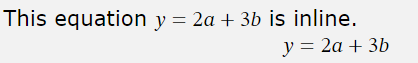
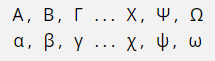
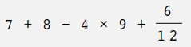
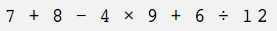
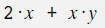
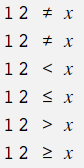
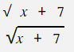
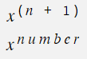
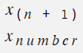
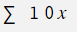

# Adding maths, or if you prefer, math

_Text2Lesson_ provides some very limited support for formatting maths at the moment. It's fast and lightweight, but only intended for handling very, very simple equations. Throw something complicated at
it, and it will almost certainly get it wrong. With those limitations in mind, let's
see what it can currently do.

For complex maths, support for MathML will be coming soon, so watch this space.

# Inserting maths

There are two ways to insert maths into your lessons: inline or as a block.

- To insert it inline, you just surround the maths between two `{maths}` tags. You can also use `{math}`.
- To add it as a block, which will be centred on its own line, just start the line with `maths: `. You can also use `math: `.

So this code:

```
Inline maths {maths}y = 2a + 3b{maths} like this.
maths: y = 2a + 3b
```

becomes:



# Greek characters

All Greek characters can be created by typing their name. For lowercase version, type the name in lowercase and for uppercase versions, type the first character in uppercase.

So this code:

```
maths: Alpha, Beta, Gamma ... Chi, Psi, Omega
maths: alpha, beta, gamma ... chi, psi, omega
```

becomes:



# Operators

The characters **+**, **-**, and **\*** are converted to the operators **+**, **&minus;** and **&times;**. Division is represented by the **/** character, but is presented differently in block and inline modes.

This code:

```
maths: 7 + 8 - 4 * 9 + 6 / 12
```

becomes:



Whereas, this code:

```
{maths}7 + 8 - 4 * 9 + 6 / 12{maths}
```

becomes:



# Centre dot

Any full stop between alphabetic characters or a digit and a following alphabetic character is converted to a centre dot.

So, this code:

```
maths: 2.x + x.y
```

becomes:



# Comparison operators

- The **not equal** operator can be written as **ne** or **!=**.
- The **less than** operator can be written as **<**.
- The **less than or equal to** operator can be written as **<=**.
- The **greater than** operator can be written as **>**.
- The **greater than or equal to** operator can be written as **>=**.

This code:

```
maths:  12 ne x
maths:  12 != x
maths:  12 < x
maths:  12 <= x
maths:  12 > x
maths:  12 >= x
```

becomes:



# Square roots: the radical symbol

Square roots can be created by writing **sqrt**. If it is immediately followed by more characters enclosed in square brackets, a line is drawn over the top of those characters.

This code:

```
maths: sqrt x + 7
maths: sqrt[x + 7]
```

becomes



# Powers

To raise something to the power of another, use the **^** character. Anything following in parentheses will be presented as superscript. If parentheses are not used, all characters up to the next space will be written in superscript.

This code:

```
maths: x^(n + 1)
maths: x^number
```

becomes



# Subscripts

To create a subscript, use the **\_** character. Anything following in parentheses will be presented as subscript. If parentheses are not used, all characters up to the next space will be written in subscript.

This code:

```
maths: x_(n + 1)
maths: x_number
```

becomes



# Integrals and partial derivatives

Integrals are created by writing **int**. Partial derivatives are created by writing **d:**.

This code:

```
maths: d:x/d:t = 3x + 10

maths: int 10x dx
```

becomes


# Summation

The summation symbol can be created by just writing **sum**.

So, this code:

```
maths: sum 10x
```

becomes:


