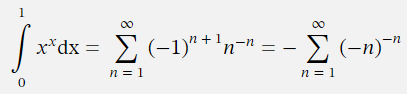
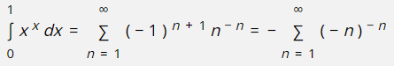

# 🧮 Adding maths, or if you prefer, math

_RapidQandA_ provides two methods of adding maths:

- [AsciiMath](./asciimath.md): a way of creating mathematical expressions by just using standard text characters.
- [MathML](./maths-ml.md): a complex markup language. It's verbose and best created using an authoring tool.

Choose your option: [AsciiMath](./asciimath.md) or [MathML](./maths-ml.md).

Both methods use the [MathML markup language](https://developer.mozilla.org/en-US/docs/Web/MathML) to render the expressions. If your browser does not support [MathML](https://developer.mozilla.org/en-US/docs/Web/MathML), the program will do its best to simulate
the output. The differences are shown below for an example equation.

## Browser with MathML support

## Fallback if MathML is not supported by the browser

