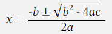

# Using AsciiMath

**AsciiMath** allows you to type equations just using the standard characters you have on your keyboard. It tries to use text to mimic the way the characters will finish up being rendered. For example typing `oo` will finish up as infinity .

**AsciiMath** is quick and reasonably intuitive. However, for complex maths, you may prefer to use an authoring tool that can generate [MathML](https://developer.mozilla.org/en-US/docs/Web/MathML) for embedding directly in your lessons; if this is the way you want to go, see [Using MathML](./maths-ml.md).

# Inserting maths

There are two ways to insert **AsciiMath** into your lessons: inline or as a block.

- To insert it inline, you just surround the maths between two `{maths}` tags. You can also use `{math}`, `{amath}` or `{amaths}`.
- To add it as a block, which will be centred on its own line, just start the line with `maths: `. You can also use `math: `, `amath: ` or `amaths: `.

So this code:

```
This equation {maths}y = 2a + 3b{maths} is inline.
```

becomes:


Whereas this code:

```
maths: y = 2a + 3b
```

becomes:


# AsciiMath syntax

To start writing your mathematical expressions, check the [AsciiMath syntax page](http://asciimath.org/#syntax). The syntax page also includes a live preview, so you can see how your final expression will look. The syntax is very intuitive, but you will probably need to refer to the [AsciiMath syntax page](http://asciimath.org/#syntax) for more complicated expressions.

Take a look at this example:

```
x = (-b +- sqrt(b^2 - 4ac))/(2a)
```

You could probably see what that equation was going to look like. Here it is rendered in _Text2Lesson_:


