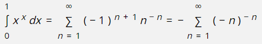

# MathsMl

_Text2Lesson_ has its own inbuilt formatter for [maths](./add-maths.md). This is fine for very,
very simple equations, but it is not intended for complex maths formatting.

If you want to include complex maths in your lessons, you will need to use
[MathML](https://developer.mozilla.org/en-US/docs/Web/MathML).

If your browser does not support **MathML**, the program will do its best to simulate
the output. The differences are shown below for an example equation.

## Browser MathML support

## Fallback support if MathML not supported by the browser

# Using MathML

Using **MathML** is simple &mdash; just paste it into your lesson. Creating the
**MathML** is a slightly different question. Creating maths using
**MathML** creates quite verbose lessons, and although you can write it by hand, using
an equation writer will make it much easier. Here are two possible options:

- **[LibreOffice Math](https://www.libreoffice.org/)**: if you have [LibreOffice](https://www.libreoffice.org/) installed you can use its equation editor to create mathematical expressions in **MathML**. How to use it is explained later.
- **[MATHML Central](https://www.mathmlcentral.com/Tools/ToMathML.jsp)**: [Wolfram Research](http://www.wolfram.com/) have an online tool
  at [MATHML Central](https://www.mathmlcentral.com/Tools/ToMathML.jsp) which can be used to create mathematical expressions in **MathML**. You will need to understand
  how to input equations using their TraditionalForm or StandardForm syntax.

# Using LibreOffice

1. To create the necessary MathML in [LibreOffice](https://www.libreoffice.org/), you will first need to install the application.
2. Then launch **LibreOffice Math**.
3. Use the equation editor to create the maths formula.
4. Select **File | Save As**, and when the **Save As** dialog appears, set the
   **Save As Type** field to **MathML 2.0 (\*.mml)**, and save the file.
5. Open the resulting file in a simple text editor such as _Notepad_ on Windows or _TextEdit_ on a Mac.
6. Copy all the text starting from **&lt;math...** and ending **&lt;/math>** &mdash; basically everything except the line `<?xml version="1.0" encoding="UTF-8"?>`.
7. Paste it into your lesson.
8. Enjoy the results.
